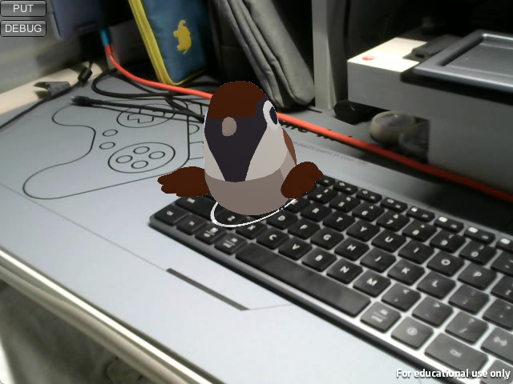
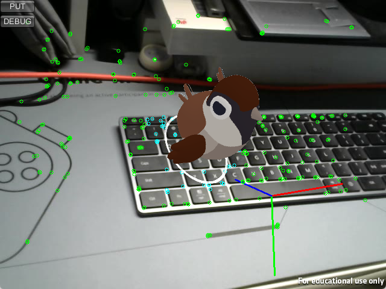

# ARLab
### an AR Experimental Application based on SLAM and Unity3D

    
    

 

## Environment
- Windows 11
- Unity 2020.3.21f1
- Visual Studio 2019
- OpenCV 4.6
- ORB-SLAM2

## SLAM
The system locator is built based on ORB-SLAM2 which simplified the `viewer` module. To config SLAM system, go to directory `${Unity_project}/Config/ORB.yaml`.

View more details at `SLAM_lib/readme.md`.

## Unity
The system render is based on Unity3D. The shared library of SLAM system built with Visual Studio 2019 is at directory `${Unity_project}/Assets/Plugins/locator.dll`.

Press `PUT` button to re-put the AR model, which will look at the camera.
Press `DEBUG` button to view track points on slam-system, the plane detected and the original point of the world-coordinate-system.

At first time use, you may need to place `${Unity_project}/Assets/MainScene.unity` to the scene list and remove the original one.

## On Working
- [ ] **MORE** interactive operations
- [ ] **IMPROVE** the accuracy of plane detected on SLAM system
- [ ] **IMPORT** `Yolo` to solve the problem of *dynamic* objects and *covered* objects
- [ ] **EXPORT** and build application for `Android` devices

## Contact
To contact with the author, please send email to `halc@bupt.edu.cn`