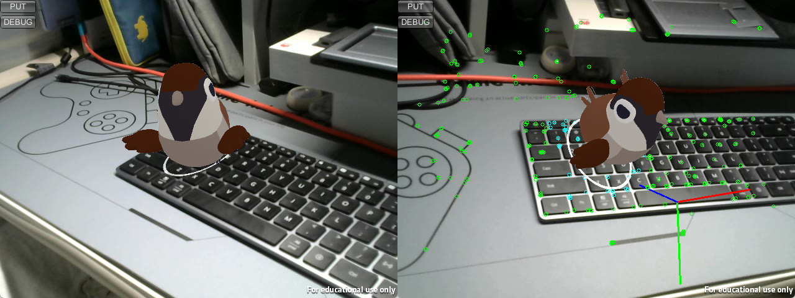
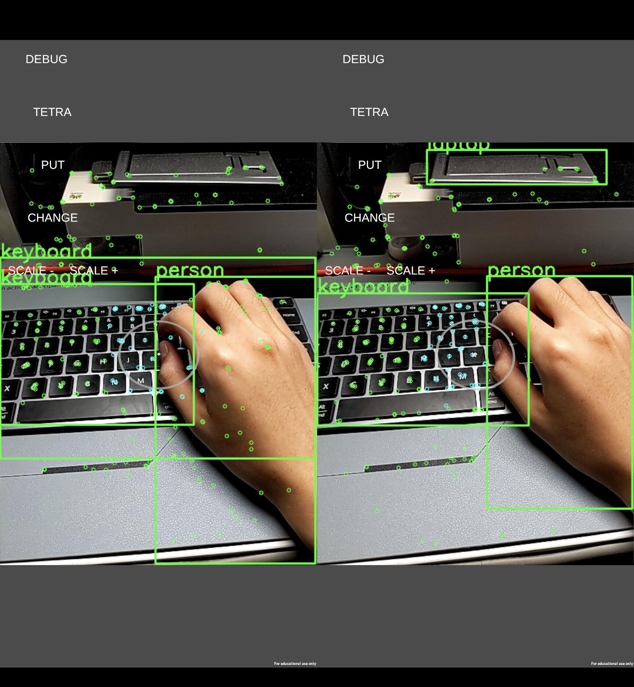

# ARLab
### an AR Experimental Application based on SLAM and Unity3D

 

**[ARM64 Android Device]**

**[X64 Windows Device with USB Camera]**

 

## Environment
- Windows 11
- Android 13
- Unity 2020.3.21f1
- Android Studio 2022.1.1
- Visual Studio 2019
- OpenCV 4.6
- ORB-SLAM2

## SLAM
- The system locator is built based on ORB-SLAM2 which simplified the `viewer` module. To config SLAM system, go to directory `${Unity_project}/Config/ORB.yaml`.

- View more details at `SLAM_lib/readme.md`.

## Unity
- The system render is based on Unity3D. The shared library of SLAM system built with Visual Studio 2019 is at directory `${Unity_project}/Assets/Plugins/locator.dll`.

- Press `PUT` button to re-put the AR model, which will look at the camera.Press `DEBUG` button to view track points on slam-system, the plane detected and the original point of the world-coordinate-system.

- At first time use, you may need to place `${Unity_project}/Assets/MainScene.unity` to the scene list and remove the original one.

## Android
- The system now is available on Android devices. You should check the `jnilibs` directory so that youc can build the application successfully. Especially, the `libc++_shared.so` is required but it is not included when exported from Unity3D.

- To use the app, don't forget to grant the camera permission. On the UI, you can press `PUT` button to re-put the AR model, which will look at the camera just as it done on windows. Press `DEBUG` button to view track points on slam-system, the plane detected and the original point of the world-coordinate-system.

- The Sparrow model will randomly change its animation from 5s to 15s. You can also manually change the animation by pressing the `CHANGE` button. To change the scale of the model, pressing `SCALE-` and `SCALE+` buttons.

- It is now tested to put a tetra on the plane detected, which is drawn by `OpenCV` instead of unity3D. Press the button `Tetra` to take a try.

- **[NOTICE]** When first installing the app, you need to copy the `Config` folder to the `/storage/emulated/0/Android/data/com.labx.arlab/files/` directory so that the app can find config files. The zipped file of `Config` folder is in the `Assets` directory of the repo and also at the `release` page.

- **[IMPORTANT]** To make your AR model more accurate, you'd better calibrate your camera and set calibtation parameters in the 'Config/ORB.yaml' file. Pay attention that the camera is opened as `480*640`, and the scene is set fitting the width of your device. So the `Camera.fx` and `Camera.fy` are better set base on testing your own devices. As a reference, the `Camera.fx` and `Camera.fy` of device with height of `1080` are all set to `1320`.

## YOLOv5
- `YoloV5` are now integrated into the project (arm64) to solve the problem of *dynamic-objects* and `coverd-objects`. Now the system is able to delete the key points which are in the bounding box of the detected dynamic objects. However, the system is just simply classify the *dynamic-objects* with a high percentage in daily life, such as `persons` ,`animals`, etc. Yolo is not able to really detected dynamic objects.
- The `YoloV5`, using the *offical model*, is based on `NCNN` by `tencent`, which is aimed at improving the speed of image processing. The system running on `Google Pixel 5` (with Qualcomm Snapdragon 765G) get above *15* fps.
- This is a snap shot to show the result of *dynamic-objects points* exception. **The right picture is using yolo while the left not.**
  

## On Working
- [x] **MORE** interactive operations
- [ ] **MORE** beautiful user-interface
- [x] **IMPROVE** the tracking effect of SLAM system
- [x] **IMPROVE** the accuracy of plane detected on SLAM system
- [x] **IMPORT** `Yolo` to solve the problem of *dynamic* objects 
- [ ] **USING** `Yolo` to solve the problem of *covered* objects
- [x] **EXPORT** and build application for `Android` devices

## Contact
To contact with the author, please send email to `halc@bupt.edu.cn`

 

### Enjoy Your AR Experience!
